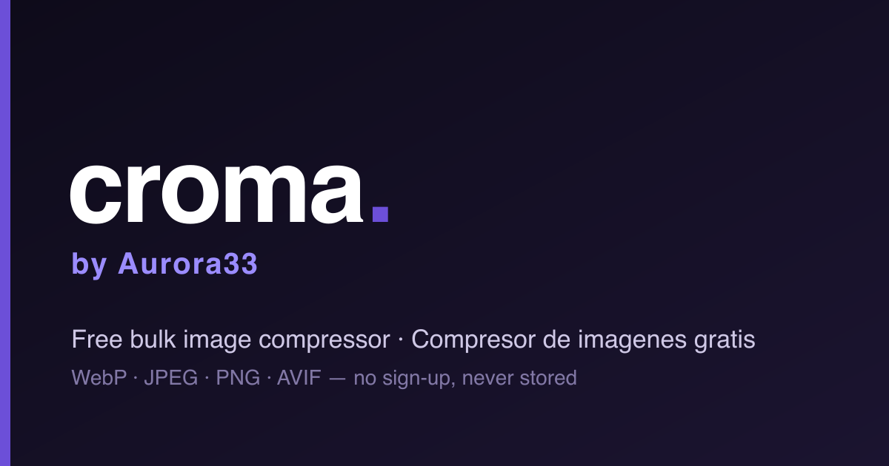

<!-- Language switch -->
**English** · [Español](./README.es.md)

<p align="center">
  
</p>

<h1 align="center">Croma</h1>

<p align="center">
  A free, no‑sign‑up image compressor. Compress, resize and convert images in bulk — right in your browser.
</p>

<p align="center">
  <a href="./LICENSE"></a>
  
  
</p>

---

## What is Croma?

Croma is a bulk image compressor built by [Aurora33](https://aurora33.org). Drop in your images, pick a format and quality, and download them optimized — no account, no database, nothing stored. Uploaded files are processed temporarily and deleted automatically after one hour.

## Features

- 📦 **Bulk processing** — compress many images at once
- 🔄 **Format conversion** — WebP, JPEG, PNG, AVIF
- 🎚️ **Quality control** — adjustable compression level
- 📐 **Resizing** — optional width/height with aspect‑ratio preservation
- 🖱️ **Drag & drop** interface
- 🌍 **Bilingual** — English & Spanish (`/en`, `/es`)
- 🔒 **No sign‑up, no database** — images never stored
- ⚡ **Powered by [Sharp](https://sharp.pixelplumbing.com/)** (native, fast)

## Quick Start (local)

Requires **Node.js ≥ 20.9** (see `.nvmrc`). No database, no required configuration — it just runs.

```bash
git clone https://github.com/aurora33org/croma.aurora33.dev.git
cd croma.aurora33.dev
npm install
npm run dev
```

Open **http://localhost:3000** — that's it. ✨

### Production build

```bash
npm run build
npm start
```

## Deploy on Railway (1 click)

Spin up your own personal instance in seconds:

[](https://railway.com/deploy/m9KKnY?referralCode=ncM0Kc&utm_medium=integration&utm_source=template&utm_campaign=generic)

No database and no required variables — Railway auto‑detects Next.js (via `railway.json` → Railpack) and serves it with a health check at `/api/health`.

## Optional configuration

Everything works out of the box. To tweak limits, set these env vars (all optional):

| Variable | Default | Description |
|---|---|---|
| `NEXT_PUBLIC_MAX_FILES` | `100` | Max images per batch — **build‑time** |
| `NEXT_PUBLIC_MAX_FILE_MB` | `100` | Max size per image, in MB — **build‑time** |
| `CLEANUP_INTERVAL` | `15` | Cleanup job interval (minutes) |
| `FILE_TTL` | `3600` | File lifetime before auto‑delete (seconds) |

> `NEXT_PUBLIC_*` are inlined at build time — set them **before** building to take effect.

## Tech stack

Next.js 16 (App Router) · React 19 · Sharp · TailwindCSS · custom lightweight i18n.

## License

Croma is **free for personal and non‑commercial use**. You may use, modify and share it — but **you may not use it commercially or sell it**. It must stay free. See [`LICENSE`](./LICENSE) (PolyForm Noncommercial 1.0.0).

---

<p align="center">
  Made by <a href="https://aurora33.org">Aurora33</a> · <a href="https://aurora33.org/contacto">Need a custom solution? Get in touch</a>
</p>
